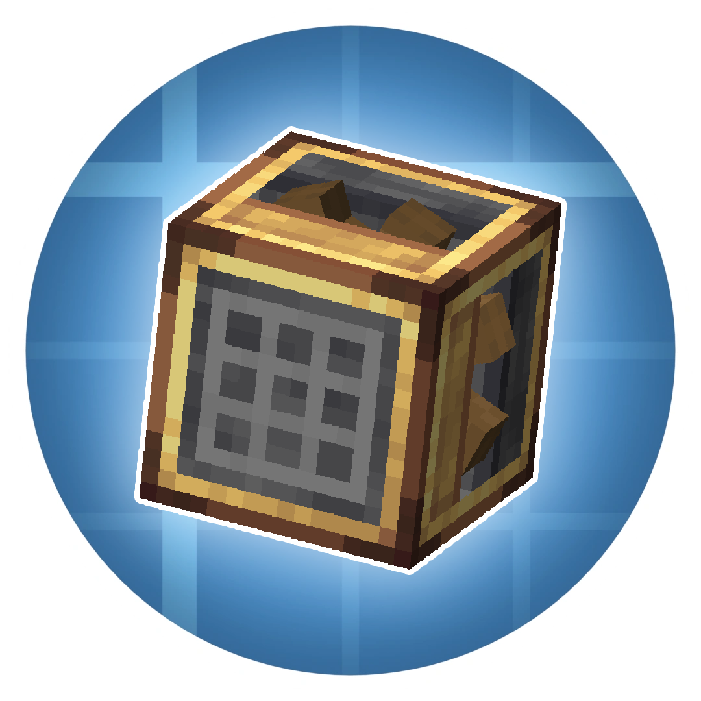

<h1 align="center">Create Smart Crafter  
	
	
	
    
      
</h1>

Installation information
=======

This template repository can be directly cloned to get you started with a new
mod. Simply create a new repository cloned from this one, by following the
instructions provided by [GitHub](https://docs.github.com/en/repositories/creating-and-managing-repositories/creating-a-repository-from-a-template).

Once you have your clone, simply open the repository in the IDE of your choice. The usual recommendation for an IDE is either IntelliJ IDEA or Eclipse.

If at any point you are missing libraries in your IDE, or you've run into problems you can
run `gradlew --refresh-dependencies` to refresh the local cache. `gradlew clean` to reset everything 
{this does not affect your code} and then start the process again.

Mapping Names:
============
By default, the MDK is configured to use the official mapping names from Mojang for methods and fields 
in the Minecraft codebase. These names are covered by a specific license. All modders should be aware of this
license. For the latest license text, refer to the mapping file itself, or the reference copy here:
https://github.com/NeoForged/NeoForm/blob/main/Mojang.md

Additional Resources: 
==========
Community Documentation: https://docs.neoforged.net/  
NeoForged Discord: https://discord.neoforged.net/
